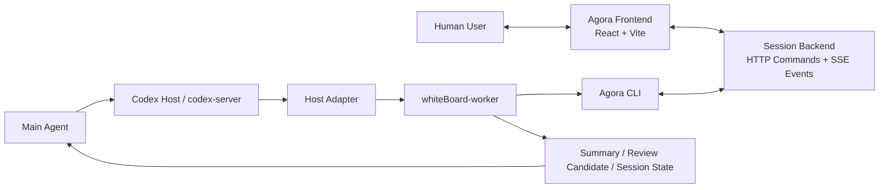

<p align="center">
  
</p>

<h1 align="center">Agora</h1>

<p align="center">
  面向 Agent 与人类协作调研的原生交互界面
</p>

<p align="center">
  让讨论、编辑、批注、审阅和回收上下文，发生在同一个协作广场里。
</p>

---

## 项目简介

`Agora` 取名自古希腊公共讨论广场。

这个项目想解决的不是“再做一个聊天窗口”，而是把 **Agent 与人类围绕同一份文稿协作** 这件事，变成一种原生、稳定、可沉淀的交互方式。

`whiteBoard` 受到 code agent 中 `spec` 文档协作方式的启发，提供一个对 Agent 友好、对人类也友好的网页界面：人类直接在页面中编辑正文、添加批注、发起下一轮推进；Agent 在后台持续跟随、生成候选修改，并通过审阅流程把结果落回文稿。

对外产品名现在采用 **Agora**。当前仓库目录名仍是 `whiteBoard`，内部 workspace 包名仍沿用 `@blackboard/*`；但面向用户的发布安装路径已经切换为 `agora` CLI。

## 解决什么问题

### 1. 传统 chat + artifacts 的人机协作体验不够好

在 ChatGPT、Claude、Gemini 等网页端里，类似画布或 artifacts 的能力通常仍依赖聊天窗口承载大量来回沟通。  
这会导致：

- 人类必须把很多本该在页面中直接表达的反馈，再手动转述回 chat
- Agent 很难稳定获取“页面上的真实修改意图”
- 讨论信息散落在聊天记录和渲染结果之间，协作成本高

Agora 的做法是：**让人类直接在网页里编辑和批注**，把交互本身结构化，而不是把一切重新塞回聊天框。

### 2. 模型厂商自带 Agent 不够开放，难以复用用户已有能力

即使解决了页面交互问题，模型厂商自带的 chat-agent 往往也难以承接用户已经配置好的复杂能力。  
今天真正有价值的往往不是“一个通用聊天 Agent”，而是用户已经积累好的工具链、skills、workflow 和外部能力。

Agora 当前优先适配 **Codex**，通过 `codex-server` / host adapter / runtime 这条链路，把用户自己在 Codex 中配置的能力引入到协作文稿流程里。

### 3. 临时讨论不应该污染主任务上下文

很多调研、讨论、方案打磨都是临时性的回合式工作。  
如果把这些迭代过程直接塞进主 Agent 线程，会污染主任务上下文，影响后续执行质量。

Agora 当前通过 Codex 的宿主执行链路，使用 **新的 worker thread** 启动 `whiteBoard-worker` 与人类协作。  
讨论结束后，再把最终沉淀结果回收给 Main Agent，而不是把整个讨论过程堆进主线程。

### 4. 更适合 Agent 生态的交付方式

Agora 不是一个封闭 SaaS，而是以 **CLI + Skill + 开源源码** 的方式交付。当前对外安装主路径是：

```bash
npm install -g agora
agora init-codex --force
agora doctor
```

这种形态意味着它既能作为终端用户产品安装，也能继续作为源码工程被本地修改和扩展。

CLI + Skill + 开源源码的价值在于：

- 便于安装、升级和本地运行
- 便于用户替换 Agent 宿主
- 便于按自己的 workflow 修改源码和 skill
- 便于逐步扩展到更多 Agent 运行环境

## 核心亮点

- **原生人机协作文稿界面**：直接面向“编辑正文 + 行内批注 + 审阅改动”设计，而不是把页面当聊天附件。
- **网页内直接交互**：人类在页面中修改内容即可表达明确判断，不需要手工把上下文搬运回 chat。
- **Agent 后台持续跟随**：用户编辑、批注、点击 `Proceed` 后，worker 会生成待审阅改动集。
- **Review 驱动落版**：支持围绕同一份文稿进行 Flow Review / PR Review 式审阅，而不是一次性覆盖输出。
- **上下文隔离**：临时协作运行在独立 worker thread 中，降低对主任务上下文的污染。
- **Codex 优先适配**：当前已打通 Codex host path，可复用 Codex skill、runtime 和本地工具能力。
- **CLI + Skill 交付**：更适合 Agent-native 的安装和分发形式，也更利于二次开发。
- **完全开源可改造**：用户可以按自己的 Agent、工作流和文档形态进行适配。

## 协作闭环

```text
Main Agent 创建协作任务
→ whiteBoard-worker 初始化会话与初稿
→ 人类在网页中编辑正文 / 添加批注
→ Agent 在后台跟随并理解修改
→ 人类点击 Proceed
→ worker 生成待审阅改动集
→ 人类审阅并接受 / 拒绝
→ 形成新版本
→ 关闭会话并把总结返回 Main Agent
```

## 系统架构



## 当前实现形态

当前仓库是一个 monorepo，主要包含：

- `apps/frontend`：人类协作页面，负责正文阅读、编辑、批注、审阅与状态呈现
- `apps/backend`：会话状态、Working Set、ReviewChangeSet、Version 等核心后端逻辑
- `apps/host-adapter`：连接 Codex 宿主与会话后端，负责 worker 启动与事件分发
- `packages/blackboard-runtime`：Agora 公共 npm CLI 的实现目录，负责嵌入运行时产物与 Codex 资产
- `packages/document-model`：Markdown 到结构化文稿单元的派生与编辑纯函数
- `packages/review-model`：审阅改动集相关的纯逻辑
- `docs/`：产品、模型、契约、UI 和 Agent 执行设计文档

## 快速开始

### 1. 发布式安装（面向外部用户）

```bash
npm install -g agora
agora init-codex --force
agora doctor
```

Skill 需要安装到：

```text
~/.codex/skills/blackboard-collaboration
```

完整外部安装与协作验证流程见 [docs/05-agent/Agora-Published-E2E-Runbook.md](docs/05-agent/Agora-Published-E2E-Runbook.md)。

### 2. 安装依赖（面向仓库开发）

```bash
corepack enable
pnpm install
```

### 3. 启动前后端

前端：

```bash
pnpm dev
```

后端：

```bash
pnpm dev:backend
```

### 4. 启动 Agent 适配链路

开发模式下可分别启动：

```bash
pnpm adapter:dev
pnpm runtime:dev
```

构建运行时产物：

```bash
pnpm build:all
```

## 测试与验证

```bash
pnpm test
pnpm test:backend
pnpm test:all
pnpm typecheck:all
pnpm build:all
pnpm e2e
pnpm harness:check
```

完整 MVP 验证顺序可参考 [docs/05-agent/MVP-Runbook.md](docs/05-agent/MVP-Runbook.md)。

发布安装 smoke：

```bash
pnpm run smoke:agora
```

## 文档导航

- [docs/README.md](docs/README.md)：完整文档索引
- [docs/01-product/Product-Overview.md](docs/01-product/Product-Overview.md)：产品总览
- [docs/Developer-Guide.md](docs/Developer-Guide.md)：开发者快速入门
- [docs/Developer-Iteration-Guide.md](docs/Developer-Iteration-Guide.md)：快速迭代开发指南（CLI + Skill + Worker Config 重装与测试流程）
- [docs/05-agent/Host-Execution-Design.md](docs/05-agent/Host-Execution-Design.md)：Codex 宿主执行设计
- [docs/03-contracts/Agent-CLI.md](docs/03-contracts/Agent-CLI.md)：Agent CLI 契约

## 适用场景

- 与 Agent 一起打磨 PRD、spec、技术设计文档
- 进行临时性的研究讨论与方案收敛
- 让人类直接在页面上对 Agent 草稿做结构化反馈
- 在不污染主任务上下文的前提下，开一个独立协作线程
- 为自己的 Agent 体系接入一个更适合文稿协作的交互层

## 命名说明

- **产品名**：`Agora`
- **仓库目录名**：`whiteBoard`
- **内部包名**：`@blackboard/*`
- **发布 CLI**：`agora`

如果后续需要统一品牌命名，可以再做一轮工程级重命名；当前这份 README 先统一对外表达。

## License

本项目当前未在仓库根目录声明单独的许可证文件；如需对外发布，建议补充明确的 `LICENSE`。
