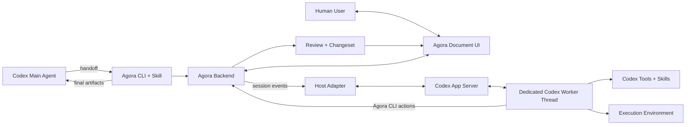

<p align="center">
  
</p>

<h1 align="center">Agora</h1>

<p align="center">
  English · <a href="./README.zh-CN.md">中文</a>
</p>

<p align="center">
  
  
  
  
  
</p>

<p align="center">
  <strong>Codex-native human–agent collaboration for drafting, editing, annotating, and reviewing documents.</strong>
</p>

Agora is an open-source collaboration layer built on the **open-source Codex agent harness and Codex App Server**.

Instead of replacing Codex with a limited embedded chatbot, Agora keeps Codex as the agent runtime—including its tools, skills, execution environment, and thread lifecycle—while providing a document-native interface where people can edit, comment, review, approve, and merge agent-generated changes.

> Bring the Codex agent loop into the document workflow, rather than bringing the document back into a chat box.

**Codex App Server · Worker Threads · Host Adapter · Human-in-the-loop Review · CLI + Skill · Apache-2.0**


## Built on the Codex Open Agent Harness

Agora is not a generic LLM wrapper and does not implement a separate lightweight agent runtime. Its current runtime integration is built natively around Codex and communicates with `codex app-server` through its documented client protocol.

**Codex provides the agent loop:**

- conversation and worker thread lifecycle
- multi-turn task continuation
- tool and skill execution
- streamed execution events and progress
- sandbox and approval primitives
- the user's existing Codex environment and workflows

**Agora provides the collaboration layer:**

- document-native editing and annotations
- structured human feedback
- Proceed → Review → Merge workflows
- version and changeset review
- a dedicated worker for each collaboration session
- final artifact handoff to the originating Codex task

This division lets Agora preserve the full Codex runtime while building an interface specifically for iterative document collaboration. It follows the general application pattern described in OpenAI's [“Codex as a platform: build on the open agent harness”](https://developers.openai.com/blog/codex-as-a-platform): the application owns its product-specific interface and workflow, while Codex provides the underlying agent loop. Agora is an independent open-source project and is not an official OpenAI reference implementation.

## Why Agora

### Collaboration lives on the document

Users edit text, attach comments, and make review decisions directly beside the content. They do not need to repackage a long document and its latest context into another chat message.

### The agent follows the latest state

The backend owns the current document, annotations, versions, and review state. The Codex worker receives structured events and continues from that shared state after each human edit or decision.

### Iteration stays out of the main task

Draft exchanges and review work run in a dedicated Codex worker thread. When the session closes, Agora returns the final document and summary artifacts to the originating task instead of filling its context with every intermediate step.

### The integration ships as a CLI and Codex Skill

Agora installs its runtime, collaboration Skill, and worker configuration through a public npm package, making the full path reproducible outside this repository.

## Architecture



| Layer | Responsibility |
|---|---|
| **Agora UI and Backend** | Document state, annotations, review flow, versions, and human decisions |
| **Host Adapter** | Session event queue, App Server communication, worker lifecycle, and result relay |
| **Codex App Server** | Thread and turn lifecycle, streamed events, execution, and runtime controls |
| **Codex Worker** | Reasoning, tools, skills, local working files, and candidate generation |

The Host Adapter connects the product workflow to Codex while keeping each collaboration worker isolated from the Main Agent until the workflow completes. The implementation starts `codex app-server --listen stdio://` and uses `thread/start`, `thread/resume`, `turn/start`, and streamed completion events.

## Key Features

- **Codex-native runtime** — Uses Codex App Server, tools, skills, execution capabilities, and multi-turn worker sessions instead of embedding a weaker replacement agent.
- **Document-native collaboration** — Humans edit, annotate, and review directly on the document.
- **Dedicated worker threads** — Each collaboration session runs through an independent Codex worker without polluting the Main Agent's iteration history.
- **Proceed → Review → Merge** — Agent proposals remain visible and controllable before they become part of the document.
- **Host-controlled execution** — Agora's Host Adapter serializes session events and bridges the product lifecycle with Codex threads and turns.
- **Version-aware review** — Users can inspect flow reviews, PR-style changes, and document history.
- **Open and extensible** — Runtime, UI, CLI, Skill, protocols, tests, and integration code are available under Apache-2.0.

## Why Codex App Server?

Agora treats the agent as part of the product, not as a one-shot model call. Document collaboration is stateful: a user may edit a draft, leave comments, ask the agent to continue, inspect proposed changes, reject only part of them, and begin another iteration.

[Codex App Server](https://developers.openai.com/codex/app-server) is designed for deep product integrations that need conversation history, approvals, and streamed agent events. Agora uses it for:

- persistent, multi-turn worker sessions
- resumable Codex threads during the collaboration lifecycle
- streamed turn progress and completion events
- access to Codex tools, skills, and execution environment
- host-controlled thread and turn lifecycle
- a clear boundary between application state and agent execution

Agora therefore builds around Codex instead of recreating these capabilities in a separate runtime.

## Quick Start

### 1. Install the CLI

```bash
npm install -g @sunxie/agora
```

### 2. Install and verify the Codex assets

```bash
agora init-codex --force
agora doctor
```

This installs the Agora collaboration Skill and dedicated worker configuration into your Codex home.

### 3. Start a collaboration

Open Codex in the folder where you want to work and invoke:

```text
$blackboard-collaboration
```

The Skill starts the Agora runtime, creates a dedicated Codex worker, and returns the collaboration URL. For the complete workflow, see the [published end-to-end runbook](./docs/05-agent/Agora-Published-E2E-Runbook.md).

### Local development

```bash
corepack enable
pnpm install
pnpm build:all
pnpm dev
pnpm dev:backend
```

## Screenshots

### Proceed / Processing

Agora exposes agent progress in the document workflow instead of hiding it in a chat window.


<details>
<summary><strong>More product views</strong></summary>

### Flow Review

Inspect candidate changes individually before accepting them into the current document.


### PR-style Review

Compare document changes with a review model familiar to software teams.


### History Preview

Review and compare the versions produced across collaboration rounds.


### Closed Session

After closing, the document remains available in a read-only final state.


</details>

## Security Model

Agora connects user-controlled document content to an agent runtime that can interact with files, tools, skills, processes, and network resources. Its main trust boundaries are:

- document and user content → agent context
- Codex worker → tools, skills, filesystem, and network
- Agora Host Adapter → Codex App Server
- worker-generated candidate → human review → accepted document state
- close artifacts → originating Main Agent

Consequential document changes pass through explicit human review before merge. However, **v0.1 currently launches the dedicated worker with `danger-full-access` and a non-interactive approval policy** so it can complete the local CLI workflow. Run this release only in a trusted local environment and workspace; do not use it on untrusted repositories or documents.

Security hardening is active roadmap work, including narrower sandbox defaults, approval boundaries, prompt-injection defenses, safer tool invocation, credential protection, extension validation, and filesystem/network access controls. See the [Codex Host Validation Contract](./docs/05-agent/Codex-Host-Validation-Contract.md) for the repository's explicit claim and evidence model.

## Testing, Compatibility & Maintenance

Agora includes unit, integration, architecture, smoke, and published end-to-end validation for the Codex integration path.

```bash
pnpm test
pnpm test:backend
pnpm test:all
pnpm typecheck:all
pnpm build:all
pnpm run smoke:agora
```

The validation surface covers:

- Codex worker and turn lifecycle
- Host Adapter communication and event serialization
- session initialization, review, close, and shutdown
- Proceed / Review / Merge transitions
- CLI and Skill installation
- document, version, and changeset consistency

Useful maintenance documents:

- [Developer Guide](./docs/Developer-Guide.md)
- [Developer Iteration Guide](./docs/Developer-Iteration-Guide.md)
- [Published E2E Runbook](./docs/05-agent/Agora-Published-E2E-Runbook.md)
- [Host Execution Design](./docs/05-agent/Host-Execution-Design.md)
- [Codex Host Validation Contract](./docs/05-agent/Codex-Host-Validation-Contract.md)
- [Agent CLI Contract](./docs/03-contracts/Agent-CLI.md)

## Project Structure

```text
apps/
  frontend/                 Document collaboration UI
  backend/                  Session state and review workflow
  host-adapter/             Codex App Server bridge and worker dispatch

packages/
  blackboard-runtime/       Published Agora CLI and embedded runtime
  document-model/           Document structure model
  review-model/             Review and changeset model

docs/                       Product, architecture, contracts, and runbooks
harness/                    Architecture checks and smoke validation
scripts/                    Local installation and development helpers
```

## Roadmap

### Codex Integration and Security

- [ ] Reduce Codex worker startup latency
- [ ] Improve worker → Main Agent result visibility
- [ ] Expand App Server lifecycle compatibility tests
- [ ] Add restart-safe session and worker recovery
- [ ] Replace the current full-access worker default with narrower sandbox and approval boundaries
- [ ] Add Codex Security validation workflows

### Collaboration

- [ ] Rich-text and multimodal collaboration
- [ ] Git-like document version management
- [ ] Multi-user collaboration
- [ ] In-page chat with worker agents
- [ ] Custom collaboration themes and comment states

### Additional Agent Hosts

Codex is the current first-class runtime. Other harnesses may be added later through separate adapters.

- [ ] Pickle and other agent harnesses

## Contributing

Issues and pull requests are welcome. Start with the [Developer Guide](./docs/Developer-Guide.md) and [documentation index](./docs/README.md), then run the full validation commands above before submitting a change.

## Contributors

Thank you to everyone who has helped build Agora. See the [full contributor graph](https://github.com/xiesunsun/Agora/graphs/contributors).

## Release Status

- **Current version:** `0.1.0`
- **npm package:** `@sunxie/agora`
- **GitHub package:** `@xiesunsun/agora`
- **Global command:** `agora`
- **License:** `Apache-2.0`

## License

This repository is licensed under [Apache-2.0](./LICENSE).
