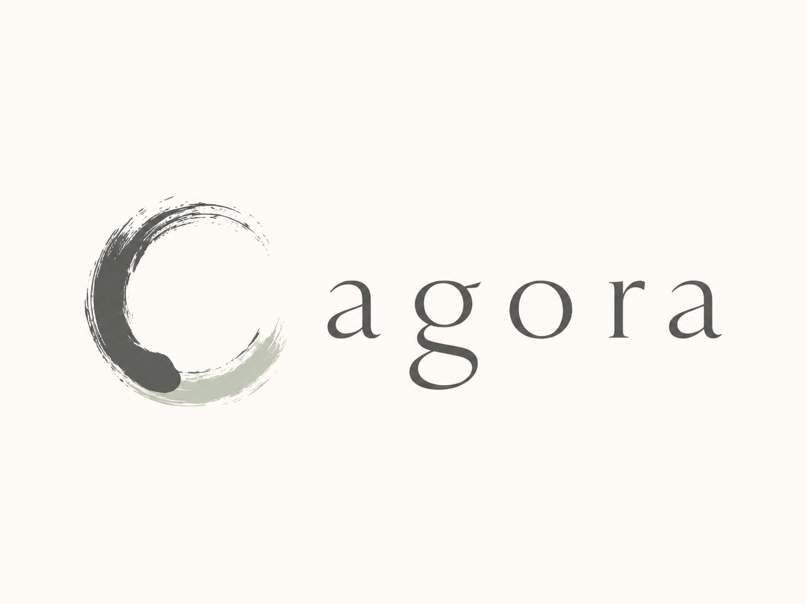
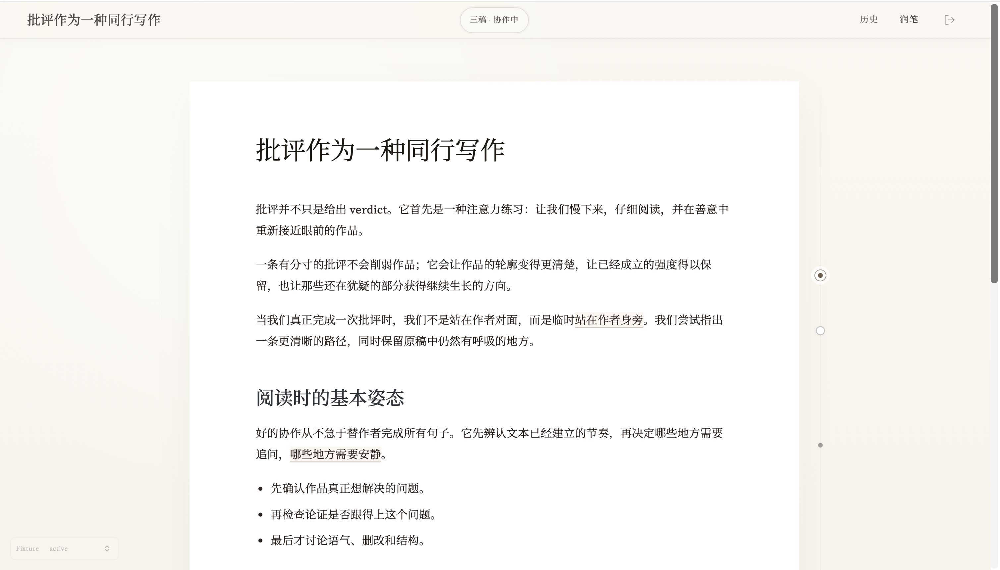
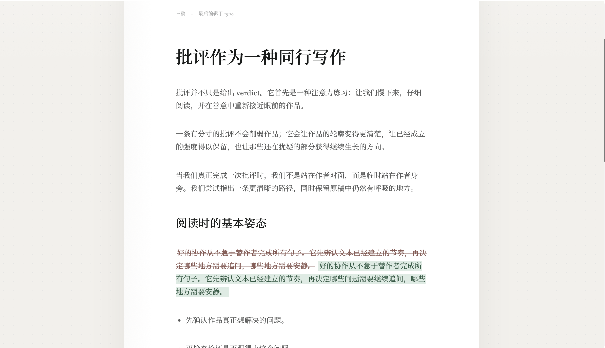
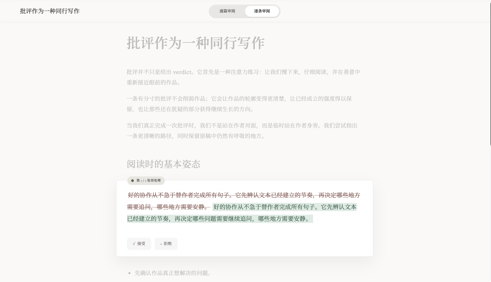
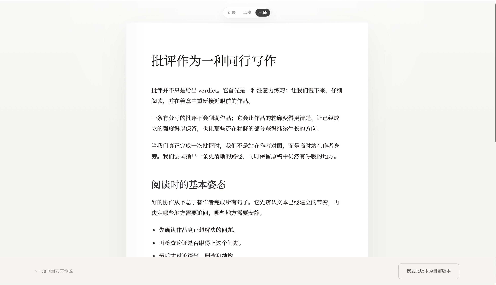
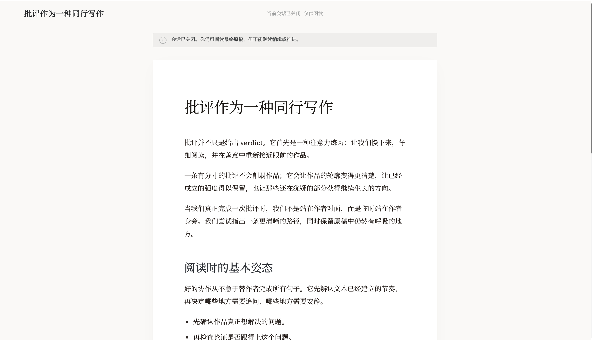

<p align="center">
  
</p>

<h1 align="center">Agora</h1>

<p align="center">
  <a href="./README.md">English</a> · 中文
</p>

<p align="center">
  
  
  
  
  
</p>

> Agora 是一个原生面向 Agent 与人类交互的开源协作产品，重新定义了文稿起草、修改、批注与审阅的工作方式，把协作从聊天窗口带回到内容本身。

Agora 不是把长文塞回聊天窗口反复改写的工具。它把起草、编辑、批注、推进、审阅和收尾总结组织成一种更符合人类写作习惯的可交互网页协作方式：用户可以直接在文稿页面里修改正文、留下批注、做出判断，不需要把大量上下文重新整理后再发回对话框；Agent 则在后台围绕当前内容持续工作，并把候选改动通过审阅流程交还给用户确认。

它适合用于打磨 Spec、PRD、技术方案、研究笔记、说明文档和其他需要“多轮修改 + 人机共同判断”的内容。

## 一种更适合人类与 Agent 的协作方式

### 1. 不再把协作塞回聊天框

很多聊天产品里的画布或 artifacts 功能，本质上仍然要求用户把新的上下文重新组织后发回对话框。Agora 把协作放回文稿本身：用户可以直接在页面里编辑、批注和审阅，不需要反复搬运上下文。

### 2. 复用现有 Agent 能力，而不是重造一个弱 Agent

Agora 当前优先适配 Codex。你已经在 Codex 里配置好的工具、skills、工作流和执行能力，都可以带进这条协作文稿链路，而不是退回到一个能力受限的内置聊天 Agent。

### 3. 协作线程独立，不污染主任务

临时讨论、草稿往返、审阅判断都发生在独立 worker thread 里。协作结束后，再把最终结果和总结回收到 Main Agent，避免把整个迭代过程污染主任务上下文。

### 4. 以 CLI + Skill 交付，方便安装、升级和定制

Agora 通过 CLI 和 Skill 交付，适合真实安装和反复测试。项目完全开源，用户可以按自己的 Agent 宿主、技能体系和工作流继续扩展。

## 核心亮点

- **围绕文稿本身协作**：以更符合人类习惯的网页交互方式完成正文编辑、批注、推进和审阅，而不是把协作重新塞回聊天窗口。
- **Agent 跟随当前文稿工作**：用户改完内容后，Agent 可以围绕最新状态继续推进，而不是依赖人工复述上下文。
- **Proceed -> Review -> Merge 闭环**：从继续生成到审阅候选改动再到合并入稿，流程完整可控。
- **独立协作线程**：协作运行在独立 worker 中，结束后再把结果回收给 Main Agent。
- **Codex 优先适配**：当前已打通 Codex App / CLI 工作流，可以直接接入用户现有的 Agent 能力、工具链和技能体系。
- **开源可扩展**：源码、CLI、Skill 一起交付，方便二次开发和宿主适配。

## 快速开始

### 安装 CLI

```bash
npm install -g @sunxie/agora
```

### 初始化 Codex 资产

```bash
agora init-codex --force
agora doctor
```

### 启动一次协作

在 Codex 中安装并触发 Agora 协作 Skill，或者通过 Agora CLI 拉起完整协作链路。

完整安装与使用流程可参考：

- [Agora Published E2E Runbook](./docs/05-agent/Agora-Published-E2E-Runbook.md)

### 本地开发

```bash
corepack enable
pnpm install
pnpm build:all
pnpm dev
pnpm dev:backend
```

## 部分运行结果

### 协作编辑主界面

文稿、批注和协作轨道在同一页里展开，用户可以直接围绕当前内容继续编辑和反馈。



### Proceed / 处理中界面

用户发起下一轮推进后，页面会明确展示 Agent 正在继续工作，而不是把等待过程藏在聊天窗口里。


### Flow Review / 流程审阅界面

当协作进入常规审阅流程时，用户可以逐项检查候选改动，再决定是否接纳到当前文稿。



### PR Review / 变更审阅界面

对于更接近代码审阅心智的改动比较，Agora 也支持以 PR 风格查看和决策。



### History Preview / 历史版本查看

协作过程中形成的版本历史可以被回看和比较，方便追溯每一轮判断和演进。



### Closed / 会话关闭结果

会话关闭后，文稿会进入只读态，用户仍然可以阅读最终结果并查看本轮协作的收尾状态。



## 适用场景

- 与 Agent 一起打磨 PRD、Spec、技术设计文档
- 在页面里直接修改 Agent 草稿并给出结构化反馈
- 进行临时性的研究讨论、方案收敛和协作文稿
- 在不污染主任务上下文的前提下，开启独立协作线程
- 为自己的 Agent 系统接入更适合文稿协作的交互层

## 技术栈

- **Frontend**：React、TypeScript、Vite
- **Backend**：Node.js、TypeScript、HTTP + SSE
- **Agent Integration**：Codex App / CLI、Host Adapter、Worker Thread
- **Runtime Delivery**：npm CLI、Codex Skill、嵌入式运行时
- **Package Manager**：pnpm 10

## 项目结构

```text
apps/
  frontend/                 文稿协作前端
  backend/                  会话状态与审阅流程
  host-adapter/             Codex 宿主桥接与 worker 分发

packages/
  blackboard-runtime/       Agora CLI 实现
  document-model/           文稿结构模型
  review-model/             审阅与 changeset 模型

docs/                       产品、架构、协议、runbook
harness/                    smoke 与验证脚本
scripts/                    本地安装与开发辅助脚本
```

## 测试与验证

```bash
pnpm test
pnpm test:backend
pnpm test:all
pnpm typecheck:all
pnpm build:all
pnpm run smoke:agora
```

常用文档：

- [Developer Guide](./docs/Developer-Guide.md)
- [Developer Iteration Guide](./docs/Developer-Iteration-Guide.md)
- [Agora Published E2E Runbook](./docs/05-agent/Agora-Published-E2E-Runbook.md)
- [Product Overview](./docs/01-product/Product-Overview.md)
- [Host Execution Design](./docs/05-agent/Host-Execution-Design.md)
- [Agent CLI Contract](./docs/03-contracts/Agent-CLI.md)

## 后续发展路线

- [ ] 优化 worker Agent 启动时间
- [ ] 优化 session 关闭时间延迟
- [ ] 解决 worker Agent 返回 Main Agent 的显示问题
- [ ] 支持 Pickle 等更多 Agent
- [ ] 支持富文本与多模态数据协作迭代
- [ ] 支持自定义协作页面主题
- [ ] 支持自定义 comment state 图标
- [ ] 支持 comment state 图标简略显示后台 Agent 意见
- [ ] 支持更接近 Git 心智的文档版本管理方式
- [ ] 支持多人协作
- [ ] 增加协作页面内的 chat-to-worker Agent 功能

## 开源状态

- **当前版本**：`0.1.0`
- **npm 包名**：`@sunxie/agora`
- **GitHub 包名**：`@xiesunsun/agora`
- **全局命令**：`agora`
- **许可证**：`Apache-2.0`

## Contributors

感谢所有参与 Agora 建设的贡献者。查看[完整贡献者列表](https://github.com/xiesunsun/Agora/graphs/contributors)。

## License

This repository is licensed under [Apache-2.0](./LICENSE).
