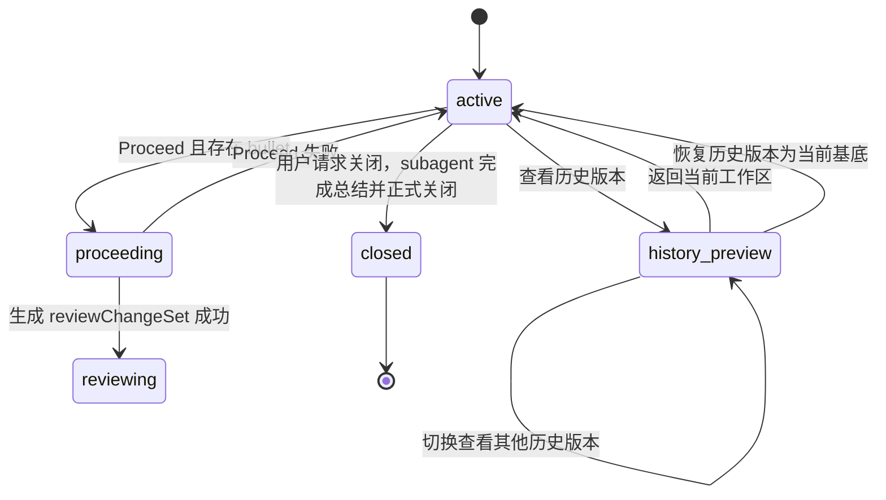

# Agent 文本黑板会话 产品交互状态机

## 1. 文档目标

本文档定义 MVP 阶段的产品交互状态机，重点回答以下问题：

* 用户当前处于哪个交互阶段；
* 当前阶段允许哪些操作、禁止哪些操作；
* 哪些事件会触发状态迁移；
* `Flow Review` 与 `PR Review` 如何共享同一份待审阅改动集。

本文档只描述产品交互语义，不展开后端实现细节。

## 2. 交互状态总览

### 2.1 顶层状态

黑板会话只有 5 个顶层交互状态：

* `active`
* `proceeding`
* `reviewing`
* `history_preview`
* `closed`

其中：

* `active` 是唯一允许生产新输入的状态；
* `reviewing` 是统一审阅态，内部再区分 `flow` 与 `pr` 两种视图模式；
* `history_preview` 是非破坏性的历史版本只读浏览态；
* `closed` 是终止态。

### 2.2 顶层状态图

## 3. 顶层状态定义

### 3.1 `active`

`active` 是正常工作态，也是唯一允许用户继续改变上下文的状态。

允许操作：

* 编辑正文文稿单元；
* 创建 `comment bullet`；
* 修改可编辑 bullet；
* 观察 Agent 小人在 bullet 队列中的后台跟随；
* 点击 `Proceed`；
* 查看历史版本；
* 关闭会话。

核心规则：

* 用户操作不会等待 Agent；
* 即使已有 bullet 处于 `processing` 或 `ready`，用户仍可继续编辑正文、继续新增 bullet；
* 用户确认正文编辑后，正文立即成为当前画布正文，同时系统生成一条 `edit bullet`；
* 当前文稿单元若仍处于 `editing`，则不能离开当前工作态进入 `proceeding`、`history_preview` 或 `closed`。

迁移：

* `active -> proceeding`
  用户点击 `Proceed`，且至少存在一条 `new | processing | ready` 的 bullet。
* `active -> history_preview`
  用户查看历史版本。
* `active -> closed`
  用户发起关闭请求，随后 `subagent` 完成总结并正式关闭会话。

### 3.2 `proceeding`

`proceeding` 是一次不可并发的回合收敛流程。页面进入全屏覆盖式处理态，用户不能继续查看正文细节或进行任何交互。

进入条件：

* 当前状态为 `active`；
* 用户点击 `Proceed`；
* 当前至少存在一条 `status = new | processing | ready` 的 bullet。

若不存在任何 bullet：

* 系统提示 `无任何修改`；
* 页面保持在 `active`；
* 不进入 `proceeding`。

`proceeding` 分为 3 个用户可感知阶段：

1. `resolving_bullets`
   等待并完成所有 bullet 的局部预处理，展示总进度，如 `3/10`。
2. `synthesizing_changes`
   Agent 基于当前最新正文与所有 bullet 的局部处理结果形成统一修改方案。
3. `materializing_review`
   Agent 将统一方案转成一份可审阅的 `reviewChangeSet`，并生成整篇正文上的 inline tracked changes 表达、语义 hunk 列表以及审阅所需元数据。

页面规则：

* 页面由 `Proceed Overlay` 完全接管；
* 不允许滚动；
* 不允许查看正文细节；
* 不允许编辑、切版本、关闭、创建或修改 bullet、再次点击 `Proceed`；
* 只展示进度、阶段文案与 Agent 动画。

迁移：

* `proceeding -> reviewing`
  成功生成 `reviewChangeSet` 后，默认进入 `reviewMode = flow`。
* `proceeding -> active`
  处理失败，回到发起 `Proceed` 前的当前工作现场。

失败回退规则：

* 不生成新版本；
* 不写入半成品候选正文；
* 不清空 bullet 队列；
* 已完成预处理的 bullet 可保持其已有状态，不强制重置为 `new`。

### 3.3 `reviewing`

`reviewing` 表示本轮 `Proceed` 已产生一份待审阅改动集，但尚未正式落版。

此时系统存在统一的：

* `reviewChangeSet`

用户看到的是一份带高亮的候选结果，而不是正式新版本。所有待处理改动都附着在这份 `reviewChangeSet` 上。

在该状态下：

* `currentVersionId` 仍指向当前正式基底版本；
* 待审阅候选结果的身份由 `reviewChangeSetId` 承担，而不是新的 `versionId`。

`reviewing` 只有两种视图模式：

* `reviewMode = flow`
* `reviewMode = pr`

共同规则：

* `flow` 与 `pr` 共享同一份 `reviewChangeSet`；
* 在任一模式中做出的 `accepted / rejected` 结果，切换到另一模式时必须立即反映；
* `reviewing` 期间不能直接编辑正文；
* `reviewing` 期间不能新建普通 bullet；
* `reviewing` 期间不能再次触发 `Proceed`。

迁移：

* `reviewing(flow) -> reviewing(pr)`
  用户切换到逐项审阅视图。
* `reviewing(pr) -> reviewing(flow)`
  用户切回整篇审阅视图。
* `reviewing -> active`
  审阅结算完成后离开审阅态。

### 3.4 `history_preview`

`history_preview` 是历史版本的只读浏览态，不是当前工作态的一个小面板。

进入后：

* 当前工作现场被临时挂起；
* 用户查看的是某个历史版本快照；
* 不改变当前工作基底；
* 不会默认丢弃当前现场。

允许操作：

* 查看目标历史版本正文；
* 切换查看其他历史版本；
* 返回当前工作区；
* 恢复当前所见历史版本为新的工作基底。

禁止操作：

* 编辑正文；
* 创建或修改 bullet；
* 点击 `Proceed`。

关键规则：

* 进入 `history_preview` 时，如果有文稿单元仍处于 `editing`，必须先完成或取消该编辑；
* 返回当前工作区时，恢复此前挂起的现场；
* 只有执行“恢复此版本为当前基底”时，才会替换当前未落版现场。
* 恢复历史版本为当前基底不生成新的 bullet；
* 恢复成功后，旧工作现场中的未结算 bullet 队列会被整体清空；
* 当前 Agent 基于旧工作基底形成的本地局部处理结果与统合草稿全部失效，必须基于新的 snapshot 重建。

迁移：

* `history_preview -> history_preview`
  用户继续切换浏览其他历史版本。
* `history_preview -> active`
  用户返回当前工作区。
* `history_preview -> active`
  用户恢复当前历史版本为新的工作基底。

### 3.5 `closed`

`closed` 是会话终止态。

进入后：

* 页面不再接受任何协作输入；
* 页面只显示结束态提示；
* 真正的会话总结内容由聊天窗口承接。

进入条件：

* 当前状态为 `active`；
* 用户点击关闭会话；
* 若存在文稿单元 `editing`，必须先完成或取消；
* 若存在未落版现场，需要用户确认后再关闭。

规则：

* 不可编辑正文；
* 不可创建或修改 bullet；
* 不可点击 `Proceed`；
* 不可切换 review mode；
* 不可从结束态继续恢复协作。

## 4. `active` 内部子状态机

### 4.1 Document Unit Editing

文稿单元状态只有两种：

* `rendered`
* `editing`

迁移：

* `rendered -> editing`
  用户双击某个文稿单元，且当前没有其他文稿单元处于 `editing`。
* `editing -> rendered`
  用户确认或取消当前编辑。

规则：

* 同一时间只允许一个文稿单元处于 `editing`；
* 文稿单元未确认前，不写入当前画布正文；
* 文稿单元未确认前，不生成 `edit bullet`；
* 双击进入编辑后，点击页面其他区域不会自动保存，也不会自动取消；
* 用户必须显式点击对勾或叉号来结束编辑；
* 文稿单元仍处于 `editing` 时，不允许触发 `Proceed`、进入 `history_preview`、或关闭会话。

确认编辑：

* 保存新的 Markdown 内容；
* 重新渲染该文稿单元；
* 更新当前画布正文；
* 生成一条 `edit bullet`；
* 顶层状态保持 `active`。

取消编辑：

* 丢弃未确认修改；
* 恢复进入编辑前内容；
* 不生成 `edit bullet`。

### 4.2 Bullet Lifecycle

Bullet 分为两类：

* `edit bullet`
* `comment bullet`

统一生命周期状态：

* `new`
* `processing`
* `ready`
* `applied`

主链路：

* `new -> processing -> ready -> applied`

含义：

* `new`
  刚进入队列，Agent 尚未开始预处理。
* `processing`
  Agent 正在做局部理解。
* `ready`
  局部处理完成，等待下一次 `Proceed` 纳入统一收敛。
* `applied`
  该 bullet 已被某轮 `Proceed -> reviewing -> 结算` 消化，不再作为待处理输入悬挂在下一轮中。

创建规则：

* 用户确认正文编辑后，生成 `edit bullet`，初始状态为 `new`；
* 用户在单个可批注文稿单元内选区并提交备注后，生成 `comment bullet`，初始状态为 `new`。

状态推进规则：

* 当某条 bullet 被当前 Agent 接手处理后，系统可自动将其从 `new` 推进到 `processing`；
* `processing -> ready` 必须发生在 Agent 确认该 bullet 的局部处理已完成之后；
* V1 中，这份局部处理结果保存在当前 Agent 的本地工作区，而不作为 backend 持久化会话对象保存。

编辑已有 bullet：

* 若 bullet 状态为 `new`，直接修改原 bullet；
* 若 bullet 状态为 `processing` 或 `ready`，不回写原 bullet，而是新生成一条 bullet 追加到队尾；
* `applied` bullet 不允许原地复活编辑，若需继续讨论，应创建新的 bullet。

显示规则：

* `displayAnchor` 只决定视觉位置；
* 处理顺序按创建时间顺序，不按视觉位置；
* 当前画布默认只展示本轮仍 relevant 的 bullet；
* 一轮审阅闭环完成后，已消化 bullet 统一进入 `applied`，并不继续展示到新一轮画布中。

## 5. `reviewing` 的共享审阅对象

### 5.1 `reviewChangeSet`

每次 `Proceed` 成功后，系统生成一份：

* `reviewChangeSet`

它代表 Agent 基于当前正文与 bullet 队列生成的一整组待审阅改动。它是 `flow` 与 `pr` 两种视图共享的唯一审阅对象。

### 5.2 单个改动项状态

每个 change / hunk 只有 3 个状态：

* `pending`
* `accepted`
* `rejected`

含义：

* `pending`
  尚未被用户明确处理；在 `flow` 中高亮，在 `pr` 中可操作。
* `accepted`
  已被接受；正文转为正常渲染，不再作为待处理项出现。
* `rejected`
  已被拒绝；对应位置回退到本轮 `Proceed` 前的基底内容，不再作为待处理项出现。

### 5.3 `flow` 视图规则

`flow` 是整篇正文上的 inline tracked changes 视图。

表达规则：

* 插入内容：高亮显示；
* 删除内容：原位保留，使用删除线和弱化颜色；
* 替换内容：表现为“旧内容删除线 + 新内容高亮”；
* `accepted` 内容：按正常正文渲染；
* `rejected` 内容：回退为基底版本内容，不再高亮。

动作：

* `Accept All Remaining`
  将所有 `pending` 改动批量转为 `accepted`。
* `Reject All Remaining`
  将所有 `pending` 改动批量转为 `rejected`。

### 5.4 `pr` 视图规则

`pr` 是逐 hunk 的语义审阅视图。

每个 `pending` hunk 只有两个动作：

* `Accept`
* `Reject`

规则：

* `Accept` 使该 hunk 从 `pending -> accepted`；
* `Reject` 使该 hunk 从 `pending -> rejected`；
* 在 `pr` 中处理过的结果，切回 `flow` 时必须同步反映到整篇正文中。

## 6. 审阅结算规则

审阅完成后，`reviewing` 必须离开，不存在无限悬停态。

结算结果有两种：

### 6.1 至少存在一个 `accepted`

结果：

* 生成新的正式版本；
* 本轮参与处理的 bullet 统一进入 `applied`；
* 顶层状态回到 `active`；
* 当前画布切换为新的正式版本正文。

### 6.2 全部为 `rejected`

结果：

* 不生成新版本；
* 回到本轮 `Proceed` 前的当前工作现场；
* 本轮参与处理的 bullet 统一进入 `applied`；
* 顶层状态回到 `active`。

补充规则：

* 若用户在 `pr` 中已接受部分改动，再切回 `flow` 执行 `Reject All Remaining`，则只拒绝剩余 `pending` 改动，已接受部分保留并正式落版；
   * `flow` 中执行 `Accept All Remaining` 并完成落版后，审阅立即终结，不能再回到 `pr`。
   * 当最后一个 `pending` 改动被处理后，backend 必须自动结算当前 review，不要求额外 finalize 动作。

## 7. 跨状态一致性规则

1. 只有 `active` 能生产新输入。
2. 任何离开 `active` 的动作，都不能携带未结束的段落 `editing` 状态。
3. `proceeding` 是全屏覆盖、不可交互的锁定态。
4. `reviewing` 是统一审阅态，`flow` 与 `pr` 只是同一份 `reviewChangeSet` 的两种视图。
5. `history_preview` 默认非破坏性，只在用户执行“恢复此版本”为当前基底时替换当前现场。
6. `closed` 是终止态，不承担继续协作职责。
