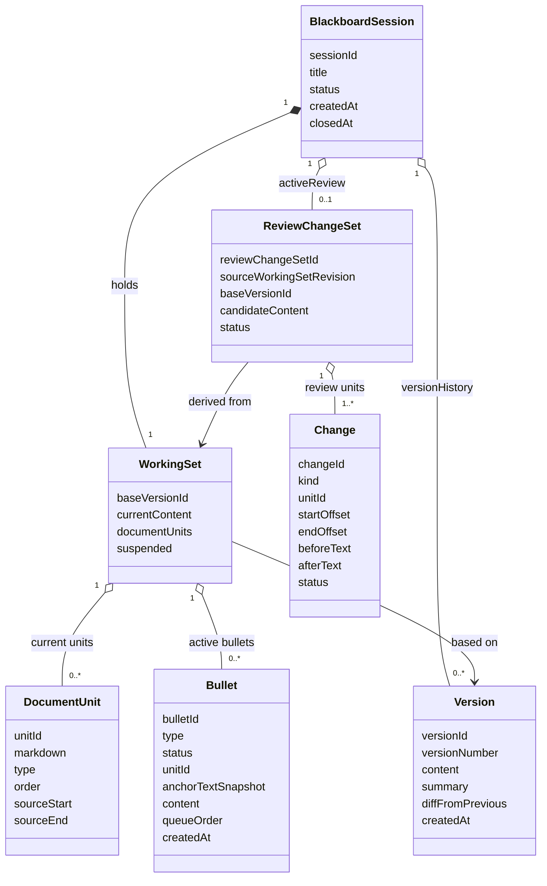

# Agent 文本黑板会话 领域模型

## 1. 文档目标

本文档定义 MVP 阶段的产品/业务领域模型，重点回答以下问题：

* 系统中有哪些核心业务对象；
* 这些对象之间是什么关系；
* 每个对象的职责、边界和不变量是什么；
* 哪些属性属于领域对象，哪些只属于交互状态或实现细节。

本文档不直接等同于数据库设计，也不展开 UI 状态机实现。

## 2. 建模原则

### 2.1 先区分三类文本状态

本产品中最容易混淆的不是“对象太多”，而是“文本到底处在哪一层”。领域模型先固定 3 层文本状态：

1. `Version.content`
   已正式落版的历史文本快照。
2. `WorkingSet.currentContent`
   当前工作现场中的最新正文，是人类已经直接改过后的当前画布正文。
3. `ReviewChangeSet.candidateContent`
   一次 `Proceed` 后由 Agent 生成的整篇候选正文，用于进入审阅。

三者的业务含义不同：

* `Version` 是历史事实；
* `WorkingSet` 是当前现场；
* `ReviewChangeSet` 是候选结果。

### 2.2 输入事件与候选改动分离

本产品还必须区分两类对象：

* `Bullet`
  人类输入事件，是 Agent 的输入。
* `Change`
  候选改单元，是审阅系统的输出。

关系可以概括为：

* `Bullet` 决定 Agent 为什么改；
* `Change` 决定系统具体哪里改。

因此：

* `Bullet` 不直接等于 diff；
* `Change` 不直接等于用户输入；
* `Change` 由系统基于 `WorkingSet.currentContent` 与 `candidateContent` 的差异计算得到。

### 2.3 领域对象与交互状态分离

以下内容属于交互状态机，而不属于领域模型核心属性：

* 当前 review 视图模式 `flow | pr`
* 当前是否有段落编辑框打开
* 页面动画、覆盖层、滚动锁定等 UI 行为

领域模型只保留长期业务语义和对象关系。

## 3. 核心对象总览

本产品的核心领域对象分为 4 个核心对象与 3 类从属实体：

### 3.1 核心对象

* `BlackboardSession`
* `WorkingSet`
* `ReviewChangeSet`
* `Version`

### 3.2 从属实体

* `DocumentUnit`
* `Bullet`
* `Change`

### 3.3 关系总览

## 4. 聚合根：`BlackboardSession`

### 4.1 定义

`BlackboardSession` 是整场协作的聚合根，代表“围绕一份文本持续协作直到结束”的完整业务会话。

它不是页面实例，不是某一版文本，也不是某次审阅结果，而是会话整体边界本身。

### 4.2 核心属性

* `sessionId`
* `title`
* `status`
  * `active`
  * `proceeding`
  * `reviewing`
  * `history_preview`
  * `closed`
* `workingSet`
* `activeReviewChangeSet`
* `versionHistory`
* `createdAt`
* `closedAt`

### 4.3 职责

1. 管理会话顶层状态迁移。
2. 持有当前唯一 `WorkingSet`。
3. 持有正式版本历史 `versionHistory`。
4. 在 `Proceed` 后挂载当前唯一 `activeReviewChangeSet`。
5. 在关闭时终结整场协作。

### 4.4 不变量

1. 一个 `BlackboardSession` 在任意时刻只能有一个顶层状态。
2. 一个 `BlackboardSession` 在任意时刻最多只能有一个 `activeReviewChangeSet`。
3. 只有正式落版的内容才能进入 `versionHistory`。
4. `closed` 之后不能再创建新的 `WorkingSet`、`Bullet` 或 `ReviewChangeSet`。
5. `history_preview` 期间不会创建第二个 `WorkingSet`，只会暂时挂起当前 `WorkingSet`。

## 5. 当前工作现场：`WorkingSet`

### 5.1 定义

`WorkingSet` 是当前工作现场，代表人类当前正在编辑、积累与推进的那一轮上下文。

它既不是正式版本，也不是待审阅结果，而是“现在进行时”的正文与输入集合。

### 5.2 核心属性

* `baseVersionId`
* `currentContent`
* `documentUnits`
* `activeBullets`
* `suspended`

说明：

* `currentContent` 是当前画布上展示的最新正文；
* 用户确认过的正文修改必须立即写入 `currentContent`；
* `suspended` 表示该工作现场是否因 `history_preview` 而被临时挂起。

### 5.3 职责

1. 持有当前画布正文。
2. 持有当前轮仍然有效的 `Bullet` 输入。
3. 作为一次 `Proceed` 的直接输入上下文。
4. 在审阅结束前，始终代表“当前现场”。
5. 在历史浏览期间被挂起，并在返回时恢复。

### 5.4 不变量

1. 一个 `WorkingSet` 只能基于一个正式版本展开。
2. 用户确认过的正文修改必须立即写入 `currentContent`。
3. 只有尚未被本轮审阅结算的 bullet 才属于 `activeBullets`。
4. 当 `WorkingSet` 被挂起时，它不能继续接受新的用户输入。
5. 当一次审阅全部 `rejected` 时，系统回到同一个 `WorkingSet`，而不是新建一个新的工作现场。
6. 当用户恢复某个历史版本为新的工作基底时，旧 `WorkingSet` 中的 `activeBullets` 会被整体清空。

### 5.5 不属于 `WorkingSet` 的内容

以下内容不进入 `WorkingSet` 的领域核心属性：

* 当前是否有段落编辑框打开
* 当前正在编辑哪一个段落
* 页面滚动位置
* review 模式切换状态

这些属于交互层，而不是业务现场事实。

## 6. 待审阅改动集：`ReviewChangeSet`

### 6.1 定义

`ReviewChangeSet` 是一次 `Proceed` 的直接业务产物，代表 Agent 基于当前 `WorkingSet` 收敛后生成的一整组待审阅改动。

它不是正式版本，也不是当前工作现场，而是一份等待人类结算的候选修改集合。

### 6.2 核心属性

* `reviewChangeSetId`
* `sourceWorkingSetRevision`
* `baseVersionId`
* `candidateContent`
* `changes`
* `status`
  * `open`
  * `resolved`

说明：

* `candidateContent` 表示“如果将这轮建议完整展开后形成的整篇候选正文”；
* `changes` 是将这份候选正文相对 `WorkingSet.currentContent` 的差异拆分后的最小可审改单元集合；
* `flow` 与 `pr` 是 `ReviewChangeSet` 的两种消费视图，但不是其领域属性。

### 6.3 职责

1. 持有一次 `Proceed` 生成的全部待审阅改动。
2. 作为整篇审阅与逐项审阅共享的统一对象。
3. 记录每个 `Change` 的接受或拒绝结果。
4. 在结算后决定是生成新版本，还是回退到原 `WorkingSet`。

### 6.4 不变量

1. 一次 `Proceed` 最多只生成一份 `ReviewChangeSet`。
2. 一个 `ReviewChangeSet` 在 `resolved` 前，不允许再次发起新的 `Proceed`。
3. `ReviewChangeSet` 结算前，不得直接写入 `versionHistory`。
4. 若所有 `Change` 最终都被 `rejected`，则该 `ReviewChangeSet` 不生成新版本。
5. `ReviewChangeSet` 的业务核心不是单独一份候选正文，而是“候选正文 + 最小可审改单元集合”。

### 6.5 `candidateContent` 与 `changes` 的区别

`candidateContent` 与 `changes` 必须明确区分：

* `candidateContent`
  是整篇候选结果快照，用于表达“如果全部接受，这轮候选正文整体会变成什么样”。
* `changes`
  是构成这份候选结果的最小可审改单元，每个改单元都可以被 `Accept` 或 `Reject`。

两者关系：

* `candidateContent` 是整体结果；
* `changes` 是局部可操作单元；
* `flow` 视图中的 inline review 效果由“当前基底正文 + changes 状态投影”生成；
* `pr` 视图中的逐项审阅也消费同一组 `changes`。

### 6.6 `Change` 的生成方式

`Change` 不是由用户直接创建的，也不是 `Bullet` 直接携带的 diff 范围，而是系统在 `Proceed` 成功后计算得到的结构化审阅单元。

生成原则：

1. 基底正文取自 `WorkingSet.currentContent`。
2. 候选正文取自 `ReviewChangeSet.candidateContent`。
3. 系统先按段落对齐，找出发生变化的段落。
4. 对每个变化段落进行段内 diff。
5. 将原子差异合并为更适合人类审阅的 `Change` / hunk。

因此：

* `Bullet` 是输入事件对象；
* `Change` 是审阅输出对象；
* `Bullet` 决定 Agent 为什么改；
* `Change` 决定系统具体哪里改。

## 7. 正式历史快照：`Version`

### 7.1 定义

`Version` 是已经正式落版、进入历史序列、可被回看和恢复的文本快照。

它承载已经成立的结果，不承载当前工作现场或待审阅状态。

### 7.2 核心属性

* `versionId`
* `versionNumber`
* `content`
* `summary?`
* `acceptedChangeSetRef`
* `diffFromPrevious`
* `createdAt`

### 7.3 职责

1. 作为正式历史版本快照进入 `versionHistory`。
2. 为历史查看提供正文。
3. 为版本间比较提供差异依据。
4. 作为后续 `WorkingSet` 的可恢复基底。

### 7.4 不变量

1. 只有当 `ReviewChangeSet` 至少存在一个 `accepted` 改动时，才能生成新的 `Version`。
2. `Version` 一旦生成，即视为不可变历史快照。
3. `Version` 必须属于某个 `BlackboardSession` 的正式历史序列。
4. 恢复历史版本不会修改原历史版本本身，只会让它重新成为新的 `WorkingSet.baseVersionId`。

## 8. 领域实体：`DocumentUnit`

### 8.1 定义

`DocumentUnit` 是正文的最小可交互结构化内容单元。

它的职责不是保存“当前页面有没有编辑框”，而是作为正文结构、选区锚点和文稿单元级编辑的承载单位。

### 8.2 核心属性

* `unitId`
* `markdown`
* `type`
* `order`
* `sourceStart`
* `sourceEnd`

### 8.3 职责

1. 作为正文的最小组织单元。
2. 承接文稿单元级编辑。
3. 承接单个可批注文稿单元内的选区备注锚点范围。

### 8.4 不变量

1. `DocumentUnit` 必须属于某个正文表达。
2. 文本选区锚点只能落在单个支持文本选区的 `DocumentUnit` 内。
3. `DocumentUnit` 的编辑态属于交互状态机，不属于领域模型主干。
4. `sourceStart` / `sourceEnd` 只对当前这次 Markdown 表达有效。

### 8.5 与 `WorkingSet` 和 `Version` 的关系

这里强调的是“可交互文稿单元化正文表达”而不是“同一个对象实例跨层共享”：

* `WorkingSet` 以 `DocumentUnit[]` 的结构化语义表达当前现场；
* `Version` 持有正式 Markdown 快照，历史查看时再按需派生 `DocumentUnit[]`；
* 两者都可以使用 `DocumentUnit` 这一结构化语义，但不要求共享同一身份。

## 9. 领域实体：`Bullet`

### 9.1 定义

`Bullet` 是用户输入被结构化后的事件对象，是 Agent 的最小输入单元。

它不是备注气泡本身，也不是正文 patch，而是一条“人类希望 Agent 注意并处理的输入事件”。

### 9.2 类型

* `edit bullet`
* `comment bullet`

### 9.3 核心属性

公共字段：

* `bulletId`
* `type`
  * `edit`
  * `comment`
* `status`
  * `new`
  * `processing`
  * `ready`
  * `applied`
* `unitId`
* `queueOrder`
* `createdAt`

说明：

* `unitId` 表示该输入主要挂靠在哪个文稿单元；
* `queueOrder` 负责表达 Agent 处理链中的先后顺序。

`edit bullet` 额外字段：

* `beforeText`
* `afterText`

说明：

* `edit bullet` 由正文确认编辑产生；
* 它的职责是通知 Agent “用户已经直接将这段内容从什么改成了什么”；
* 它是文稿单元级编辑事实，而不是待 Agent 回应的自然语言备注。

`comment bullet` 额外字段：

* `anchorTextSnapshot`
* `anchorStartOffset`
* `anchorEndOffset`
* `content`

说明：

* `comment bullet` 由单个可批注文稿单元内的备注输入产生；
* `anchorTextSnapshot` 表示创建该输入时的文本快照锚点；
* `table` 与 `code_block` 在 V1 中允许整块 comment，不强制要求字符级 offset；
* `content` 是用户提交的备注内容。

### 9.4 职责

1. 将用户输入转为 Agent 可处理的事件对象。
2. 作为 `Proceed` 的直接输入来源。
3. 记录输入与正文位置之间的关联。
4. 进入 `new -> processing -> ready -> applied` 生命周期。
5. 为当前 `subagent` 的局部处理提供因果边界：一条 bullet 对应一次独立处理闭环。

### 9.5 不变量

1. 每条 `Bullet` 只属于一个 `WorkingSet`。
2. `Bullet` 的处理顺序由 `queueOrder` 决定。
3. `edit bullet` 由正文确认编辑产生。
4. `comment bullet` 由单个可批注文稿单元内的备注输入产生。
5. `applied` 后的 bullet 不再回到待处理态；若要继续讨论，应创建新的 bullet。
6. `edit bullet` 的核心事实是 `beforeText -> afterText`，不要求精确字符级选区锚点。
7. `comment bullet` 的核心事实是“用户在某个文稿单元上的备注内容 + 选区锚点”。

### 9.6 与 diff 的边界

`Bullet` 可以携带文稿单元锚点，也可以在需要时保留创建时选区快照，但它不直接承担最终审阅 diff 的精确定位职责。

因此：

* `Bullet` 可以告诉 Agent “用户当时在说哪里”；
* `Bullet` 不直接决定最终 review 中应该高亮哪几个字符；
* 最终高亮位置与插入/删除/替换范围由 `Change` 计算结果决定。

进一步地，`Bullet` 在领域语义上应被理解为带有结构化输入锚点：

* `unitId`
* `startOffset`
* `endOffset`
* `textSnapshot`

其中：

* `comment bullet` 应具备明确的选区锚点；
* `edit bullet` 只要求保留文稿单元级编辑事实，不要求精确字符级选区锚点；
* 这些锚点服务于输入定位、Agent 理解以及 bullet 与高亮的对应关系；
* 它们不直接等同于 review 阶段的 `Change` 范围。

在交互规格中，这组锚点信息可以被展平表达为：

* `unitId`
* `anchorStartOffset`
* `anchorEndOffset`
* `anchorTextSnapshot`

## 10. 领域实体：`Change`

### 10.1 定义

`Change` 是 `ReviewChangeSet` 中的最小可审改单元。

它不是输入对象，而是系统基于基底正文与候选正文差异生成的输出对象。

### 10.2 核心属性

* `changeId`
* `kind`
  * `insert`
  * `delete`
  * `replace`
* `unitId`
* `startOffset`
* `endOffset`
* `beforeText`
* `afterText`
* `status`
  * `pending`
  * `accepted`
  * `rejected`

### 10.3 职责

1. 表示一处最小可被接受或拒绝的候选改动。
2. 同时服务于 `flow` 视图与 `pr` 视图。
3. 将审阅状态投影回整篇候选正文表现。

### 10.4 不变量

1. `startOffset` 与 `endOffset` 一律相对于基底文稿单元文本计算。
2. 使用半开区间 `[startOffset, endOffset)` 表达改动范围。
3. `beforeText` 必须等于基底文稿单元在该区间上的原文本。
4. `insert` 满足 `startOffset == endOffset` 且 `beforeText == ""`。
5. `delete` 满足 `afterText == ""`。

## 11. 生命周期摘要

### 11.1 当前工作循环

1. `BlackboardSession` 创建并进入 `active`。
2. 当前 `WorkingSet` 基于某个 `Version` 或初始正文展开。
3. 用户编辑正文或创建备注，产生 `Bullet`。
4. `Bullet` 经历 `new -> processing -> ready`。
5. 用户点击 `Proceed`。
6. 系统生成 `ReviewChangeSet` 与其中的 `Change` 集合。
7. 用户在审阅中对 `Change` 进行接受或拒绝。
8. 审阅结果要么生成新 `Version`，要么回退到原 `WorkingSet`。
9. 本轮参与处理的 `Bullet` 全部进入 `applied`。

### 11.2 历史查看循环

1. 当前 `WorkingSet` 被挂起。
2. 用户进入 `history_preview` 查看某个 `Version`。
3. 用户返回时恢复原 `WorkingSet`，或选择让某个历史 `Version` 重新成为新的 `baseVersionId`。
4. 若用户恢复历史版本为新的工作基底，旧 `WorkingSet` 中未结算的 `activeBullets` 被整体丢弃。

### 11.3 关闭循环

1. 用户确认关闭当前会话。
2. 当前 `subagent` 完成收尾总结并调用正式关闭。
3. `BlackboardSession.status` 进入 `closed`。
4. 会话终止，不再产生新的 `WorkingSet`、`Bullet` 或 `ReviewChangeSet`。

## 12. 非领域对象边界说明

以下内容不建议纳入领域模型主干：

* review 视图模式 `flow | pr`
* 当前段落是否处于编辑框打开状态
* Proceed 进度动画与覆盖层状态
* 页面滚动、布局、右侧 bullet 轨道位置算法
* diff 渲染时的具体颜色、删除线样式、高亮样式
* 当前 `subagent` 本地工作区中的 `CommentBulletResolution`、snapshot 草稿与 Proceed 统合草稿
* Agent 为了形成局部处理结果而保存的私有文件、笔记与研究材料

这些内容要么属于交互状态机，要么属于表现层实现。
